  

  
   
  came for the code, stayed for Bubby 🐾

# 🙋🏻‍♂️ About Me

Mechatronics Engineering @ University of Waterloo 🤝 Prev. Web Developer @ University of Waterloo Libraries

I enjoy turning ideas into reality through code 💻

Most of the projects I work on come from problems I have run into in my own day-to-day life, and I like turning those firsthand frustrations into tools and solutions that feel genuinely worth using

## ⚙️ Tech Stack 

  <strong>Languages</strong> 
  
  
  
  
  
  
  
  
  
  
  

  <strong>Frameworks & Libraries</strong> 
  
  
  
  
  
  
  
  
  
  
  
  
  
  
  
  
  
  
  
  

  <strong>Tools</strong> 
  
  
  
  
  
  
  
  
  
  
  
  
  
  
  

  <strong>Other</strong> 
  
  
  
  
  
  
  
  
  

## 📊 Activity

  

  

